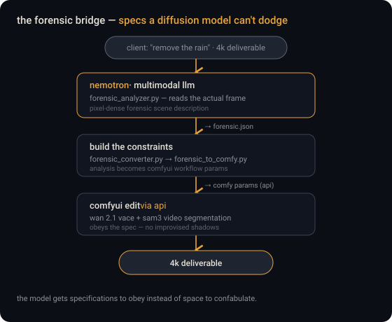
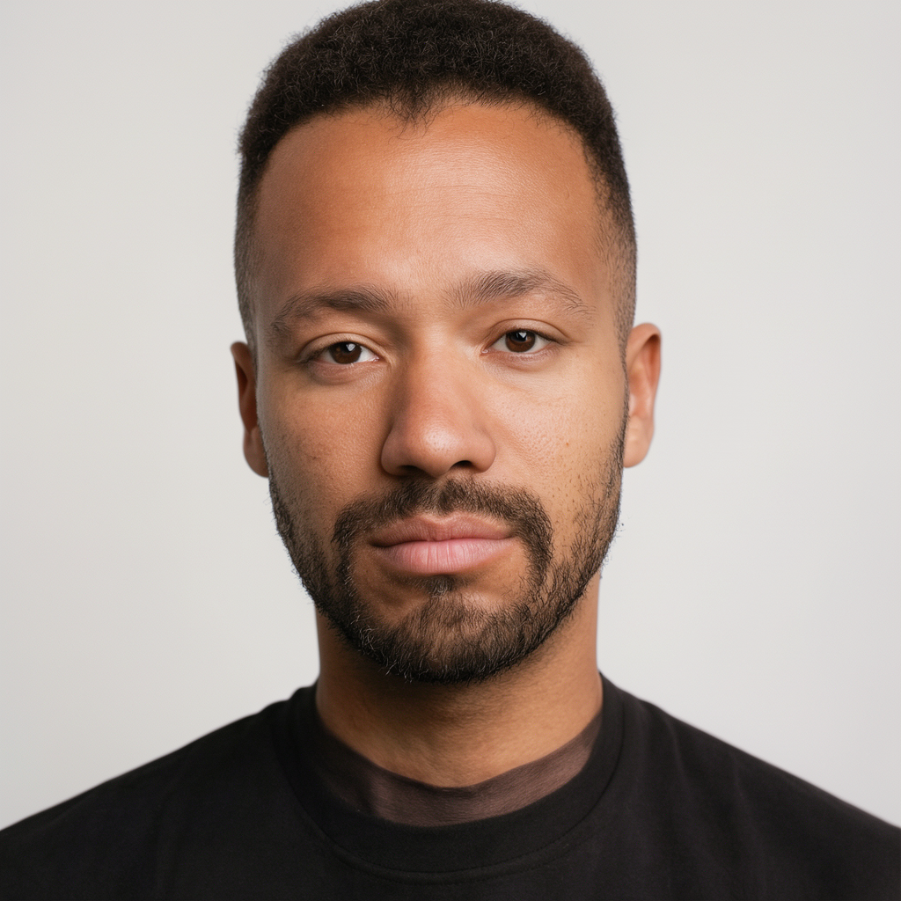
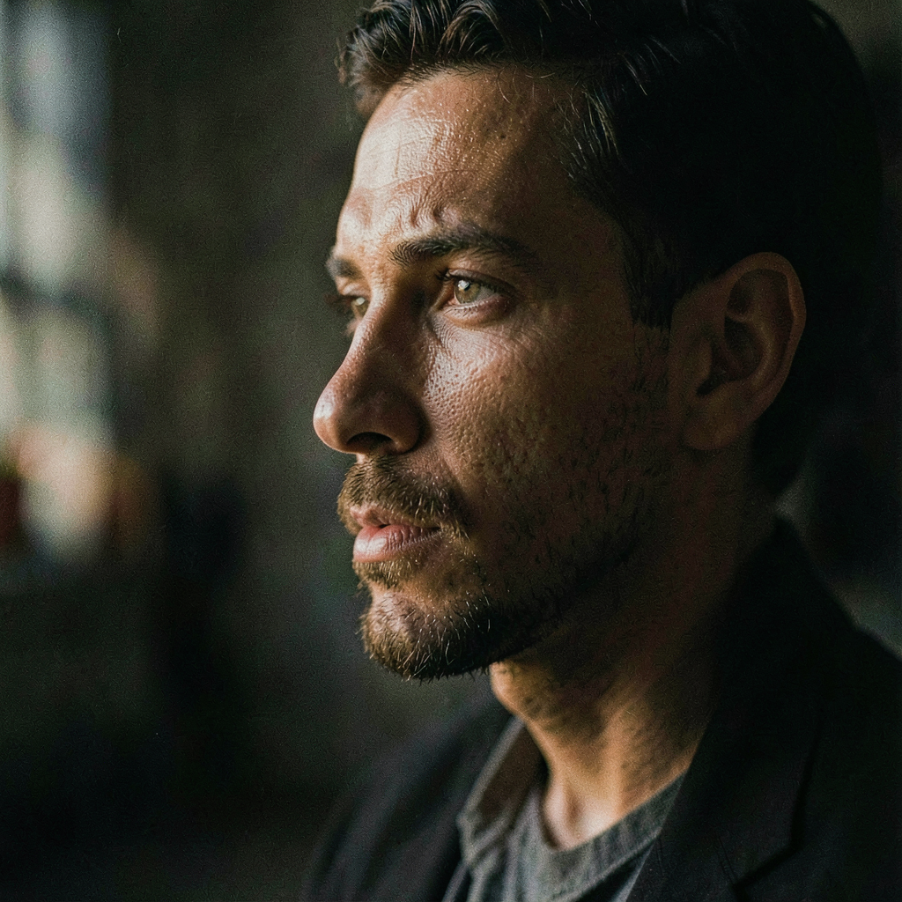

# 🎬 Mushishi Creative Stack

**A local AI video production pipeline on one RTX 5090: generation (FLUX.2 / Wan 2.2 / HunyuanVideo), editing (object removal, masked edits), and finishing (60fps interpolation, 4K upscale) — driven by a forensic-analysis bridge that turns "remove the rain" into specifications a diffusion model can't hallucinate around.**

Companion to the [sovereign AI stack](https://github.com/MushiSenpai/mushishi-sovereign-ai-stack) (the analysis brain) and the [audio stack](https://github.com/MushiSenpai/mushishi-audio-stack) (voice/music/dubbing).

<p align="center"></p>

---

## How this was built (read this first)

I don't hand-write code. Every workflow, script, and config in this repo was written by LLMs (Claude primarily; idea-stage input from Gemini, Grok, and Kimi) under my direction. My work is everything around the code: architecture and tool selection, the specs the LLMs execute against (spec-driven development with snapshot/verify gates), debugging direction, verification, and day-2 operations. I have a B.E. in Computer Science — I read code fluently; I direct rather than write it. This repo is both the artifact and the evidence that the method works. The [problems-and-solutions glossary](docs/problems-and-solutions-glossary.md) logs every fight the build involved — including a days-long Wan 2.2 artifact bug and a SAM3 tensor-dimension crash whose fixes are documented below.

---

## The six named workflows (all built + tested)

| Workflow | What it does | Models |
|---|---|---|
| ⚡ **Flashfire** | Seed-locked fast iteration images, 4 steps | FLUX.2 Klein 4B distilled (+ 9B NVFP4 variant) |
| 🔨 **Goldsmith** | Quality keyframes, 20 steps | FLUX.2 Klein base 4B |
| 🪶 **Silkmotion** | 30fps → 60fps interpolation | RIFE |
| 💎 **Crystalforge** | 720p → 4K upscale | SeedVR2 7B v2.5 + SageAttention |
| 🫥 **Vanisher** | Object removal from video — confirmed it strips an object *and its reflection* | VOID (2-pass) + RAFT optical flow |
| 🦎 **Shapeshifter** | Masked region edits in video | Wan 2.1 VACE + SAM3 video segmentation |

Workflow JSONs are in [workflows/](workflows/) — importable directly into ComfyUI.

## The interesting engineering

**The forensic bridge.** Client work (rain/object removal for 4K deliverables) fails when diffusion models improvise shadows, lighting, and materials. The fix: a multimodal LLM (Nemotron, from the sovereign stack) produces a pixel-dense forensic scene description *first* — `forensic_analyzer.py → forensic_converter.py → forensic_to_comfy.py` — and that JSON drives the ComfyUI editing workflows via API. The model gets specifications to obey instead of space to confabulate.

**SAM3 image-mode vs video-mode.** Masked video editing crashed VACE with a tensor-dimension mismatch. Root cause: SAM3 in image mode emits a single `[1,H,W]` mask, but VACE needs per-frame `[N,H,W]`. The fix was rebuilding segmentation as the four-node SAM3 *video* pipeline (load → segment → propagate → output). Documented in the glossary — it cost days.

**Wan 2.2 two-sampler chain.** Wan 2.2's MoE design needs a high-noise → low-noise two-sampler chain; running it single-sampler produces a subtle crystalline shadow artifact that looks like a model problem but is a wiring problem.

**VRAM discipline on 32GB.** Generation, editing, and finishing tiers each have known VRAM envelopes, with WanVideoWrapper patches and `blocks_to_swap` settings documented per workflow. The full spec carries the per-tier math.

## Honest status: is this client-grade?

**Being measured, not assumed.** The pipelines produce output end-to-end (Vanisher confirmed on real lab footage). Whether the output survives a paying client's scrutiny at 4K is the open question — three reference jobs (object removal on handheld footage, avatar ad-read, dubbed clip) are being scored against fixed criteria, and results land in [benchmarks/](benchmarks/) pass or fail. The benchmark table ships with empty cells on purpose: they fill in public, weekly. Real SFW sample renders are now attached per workflow — see **[See the output](#see-the-output)** below.

## See the output

Real renders from the stack — the SFW sample set the benchmark rows point at (the `sample_output` column in [`benchmarks/benchmarks.csv`](benchmarks/benchmarks.csv) links each measured row to its file). Stills preview inline on GitHub; click any video to play or download it.

<p align="center">
  
  
  
</p>

**Stills — generation & keyframes**

| Workflow | Sample | Look for |
|---|---|---|
| ⚡ Flashfire | [png](benchmarks/samples/flashfire/output_00003_.png) · [png](benchmarks/samples/flashfire/output_00002_.png) | 4-step distilled speed |
| 🔨 Goldsmith | [png](benchmarks/samples/goldsmith/output_00004_.png) · [png](benchmarks/samples/goldsmith/output_00002_.png) | 20-step keyframe fidelity |
| 🎨 QwenImage *(commercial hero, Apache-2.0)* | [png](benchmarks/samples/qwenimage/commercial_keyframe_00003_.png) · [png](benchmarks/samples/qwenimage/commercial_keyframe_00008_.png) | prompt adherence, product realism |
| 🖼️ FluxCommercial | [png](benchmarks/samples/fluxcommercial/output_00001_.png) | fast draft *(FLUX.1-dev — non-commercial licence)* |
| 🎞️ dreamforge / quickening / sharpscale | [t2v](benchmarks/samples/dreamforge/dreamforge_f0.png) · [i2v](benchmarks/samples/quickening/quickening_f0.png) · [1080p SR](benchmarks/samples/sharpscale/sharpscale_f8.png) | Hunyuan frames + true 1080p upscale |

**Motion & finishing — video**

| Workflow | Sample | Look for |
|---|---|---|
| 💎 Crystalforge | [1080p upscale](benchmarks/samples/crystalforge/e1b_00001.mp4) · [**true 4K · 3744×2160**](benchmarks/samples/crystalforge/crystalforge4k_output_00002.mp4) | detail recovery, no artifacts |
| 🫥 Vanisher | [object removal](benchmarks/samples/vanisher/void-e1d-kitchen_00001_.mp4) | clean fill, no ghost (E1d clean pass). ⚠️ the earlier **E1 attempt failed** — ghost artifact + half-res + truncated; named honestly in the [benchmark notes](benchmarks/benchmarks.csv), not shown here |
| 🦎 Shapeshifter | [masked edit](benchmarks/samples/shapeshifter/output_00001.mp4) | region-edit coherence |
| 🪶 Silkmotion | [60fps clip](benchmarks/samples/silkmotion/output_00001.mp4) | interpolation smoothness |
| 🎥 Wan 2.2 I2V / T2V | [i2v](benchmarks/samples/wan22-i2v/regression_seed42_20260528.mp4) · [t2v](benchmarks/samples/wan22-t2v/output_00001.mp4) | two-sampler MoE motion |
| ✏️ Quickdraw | [draft t2v](benchmarks/samples/quickdraw/quickdraw_00001.mp4) | fast prompt-only draft — Wan 2.1 1.3B low-res preview (seed 42) |

**Full pipeline** — keyframe → Wan I2V → ACE-Step score → mux

| Workflow | Sample | Look for |
|---|---|---|
| 🎬 maestro | [pipeline + score](benchmarks/samples/maestro/maestro_s42_final.mp4) · [keyframe](benchmarks/samples/maestro/maestro_keyframe_00015_.png) | end-to-end look + muxed music |
| 🌅 Daybreak | [pipeline clip](benchmarks/samples/daybreak/final_video_00001.mp4) | brief → keyframe → video (fast, no score) |
| 🏷️ CRE-2 Commercial | [final](benchmarks/samples/cre2-commercial/commercial_s42_final.mp4) | commercial-safe full pipeline |
| ⛓️ CRE-3 Long clip | [10s chain](benchmarks/samples/cre3-longclip/maestro_chained.mp4) | inter-segment drift — the honest limit |
| 🙂 FaceForward | [i2v](benchmarks/samples/faceforward/cre4_i2v_ff-ON_klein_seed42.mp4) | frontal framing survives I2V |

> The **KeyframeAB (Chroma vs Lustify)** benchmark row keeps its measured numbers but ships no sample clip on purpose: its comparand uses an NSFW-capable checkpoint (Lustify) that stays local by policy. Every published sample above is SFW.

## Repo layout

```
docs/              full spec (public edition) + problems-and-solutions glossary
workflows/         the six named workflows as importable ComfyUI JSON
benchmarks/        measurement template + render-benchmarks.py
benchmarks/samples/  real SFW renders per workflow (linked from the CSV)
```

Hardware: RTX 5090 32GB · Ryzen 9 9900X3D · 128GB DDR5 · Ubuntu 24.04 · CUDA 13.2.

## License

MIT for everything here. Model weights carry their own licenses — the stack deliberately uses open weights (Wan 2.2 is the open-weights ceiling; 2.5/2.6 are commercial-only, documented in the spec).
